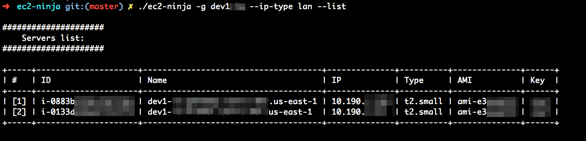
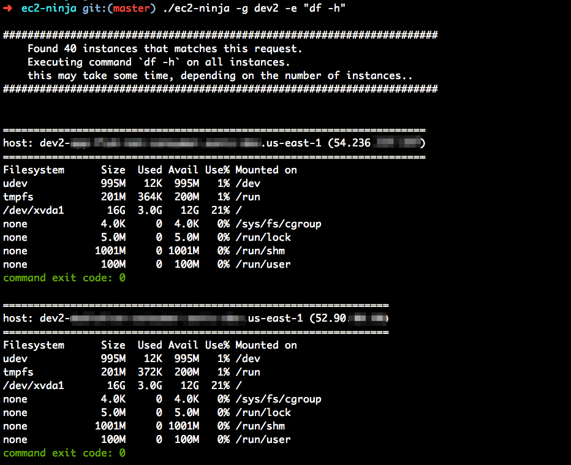
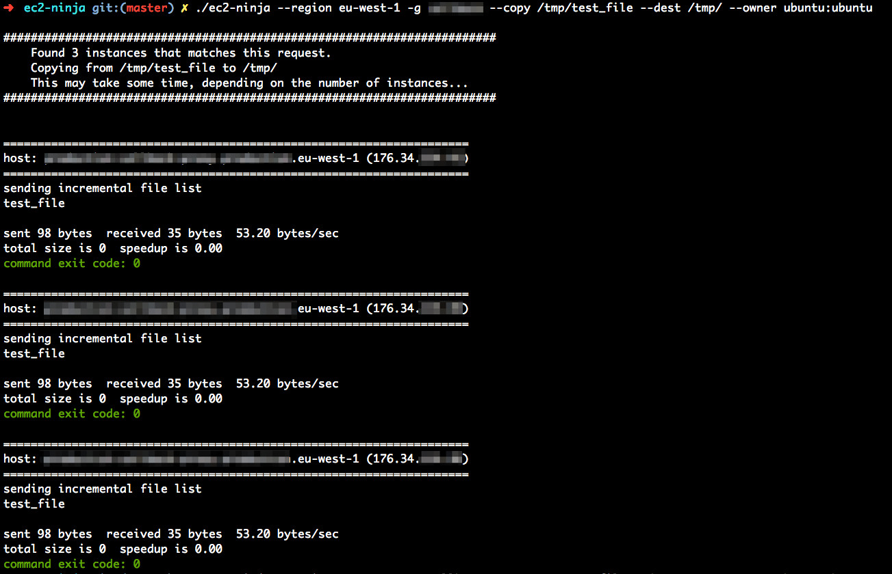
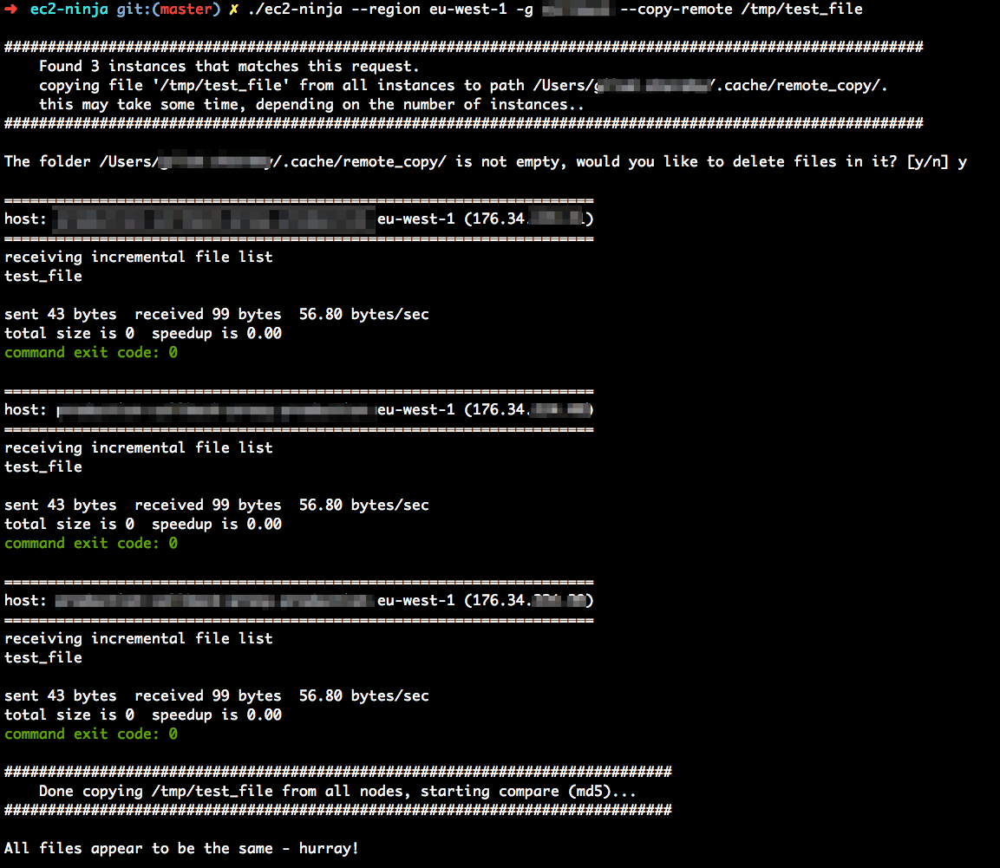
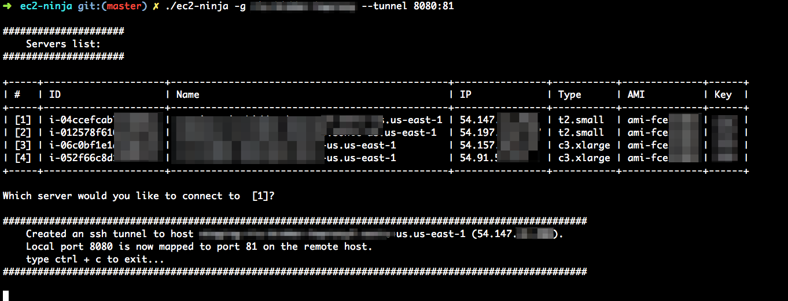

# ec2-ninja
Forked from [ssh2](https://github.com/soheil/ssh2), ec2-ninja is an interactive command line tool which allows you to to control your EC2 instances.

in additional to ssh capabilities, ec2-ninja allows you to :
* run ssh commands
* copy file to ec2 instances
* copy files from ec2 instances and compare (md5 check)
* open ssh-tunnel

## Requirements
* [AWS CLI](https://aws.amazon.com/cli/)
* Python
* Python pip
* Python package prettytable (quick install with pip install -r requirements.txt in the main folder)

## usage
ec2-ninja has the following flags -

```
Options:
  -h, --help:                         show this help message and exit
  -x, --bust-cache:                   re-fetch servers list from AWS
  -u USER, --user=USER:               provide user
  -i IDENTITY, --identity=IDENTITY:   provide identity file
  -p PROFILE, --profile=PROFILE:      provide AWS profile
  -r REGION, --region=REGION:         provide AWS region
  -g GREP, --grep=GREP:               filter the server list
  -e COMMAND, --exec=COMMAND:         run a single command
  -t SLEEP, --sleep=SLEEP:            sleep between ssh runs, cancel parallel run
  --batch-size=BATCH:                 batch size to run - this is relevant when a sleep is supplied
  --copy=COPY:                        copy a file to remote host, must be supplied with --dest option
  --dest=DEST:                        destination for file copy, must be supplied with the --copy option
  --owner=OWNER:                      change the owner of the file after copying, must be supplied with --copy/--dest option
  --copy-remote=REMOTE:               copy a file from the remote server to local folder
  --dest-remote=REMOTE_DEST:          path to save files from remote-copy (optional, default copy path is ~/.cache)
  --tunnel=TUNNEL:                    ssh tunnel to the instance - provide as <local-port>:<remote-port> or <local-port> only for the same port
  --ip-type=IPTYPE:                   choose between lan and wan address (wan is the default)
  -l, --list:                         show only list (without ssh to instance)
```

## example usage

### list ec2 instances with lan IP:


### execute a command on remote hosts:


### copy a file to remote hosts:


### copy from remote hosts and compare:


### open ssh-tunnel connection (port forwarding):



## Installation
```
git clone https://github.com/giladsh1/ec2-ninja.git
cd ec2-ninja
ln -sf $(pwd)/ec2-ninja /usr/local/bin/
```

## Author
Gilad Sharaby, giladsh1@gmail.com
